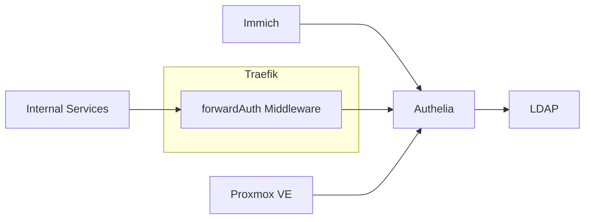
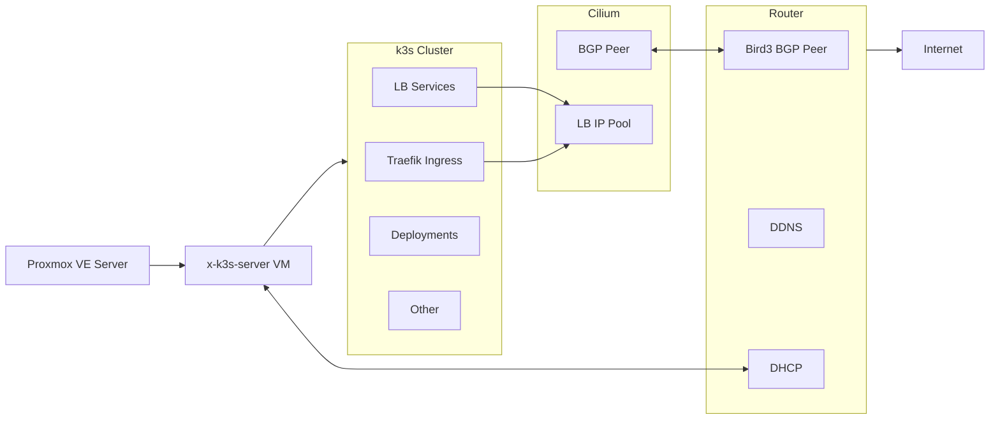
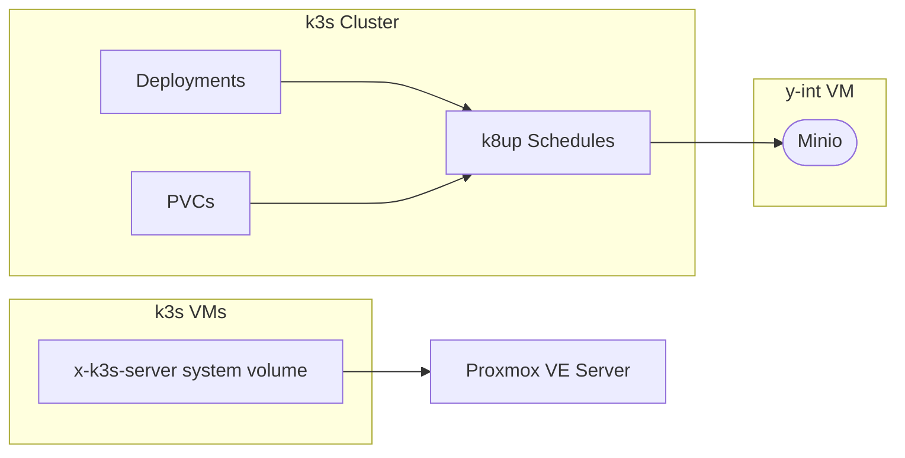

# HyvelOne k3s Cluster

This repository contains the declarative configuration of HyvelOne k3s cluster.

## Components

### Networking

- [Cilium](https://github.com/cilium/cilium) - Replaces flannel in default k3s configuration.
  Allows to get real client IPs for deployed applications.
  Connected with OpenWRT router via BGP to get reliable LB IP pool.
- [cert-manager](https://github.com/cert-manager/cert-manager) -
  Provides certificates for internal and external services.
- [Traefik](https://github.com/traefik/traefik) - Ingress (reverse-proxy/LB)

### Security

- [anubis](https://github.com/TecharoHQ/anubis) - PoW middleware to stop automatic bots/crawlers
- [lldap](https://github.com/lldap/lldap) - Lightweight LDAP implementation
- [authelia](https://github.com/authelia/authelia) - SSO for services

### Public services

- [vaultwarden](https://github.com/dani-garcia/vaultwarden) - [Bitwarden](https://github.com/bitwarden/server) server
  Rust-based implementation
- [3X-UI](https://github.com/MHSanaei/3x-ui) - [Xray](https://github.com/XTLS/Xray-core) server with web panel
- [Immich](https://github.com/immich-app/immich) - photo management/gallery app

# Structure graphs

## Authelia

## Network

## Backup

Copyright (c) tengzl33t  
This work is licensed under a Creative Commons Attribution-ShareAlike 4.0 International License (CC BY-SA 4.0).  
See [LICENSE-CONF](LICENSE-CONF) for details.